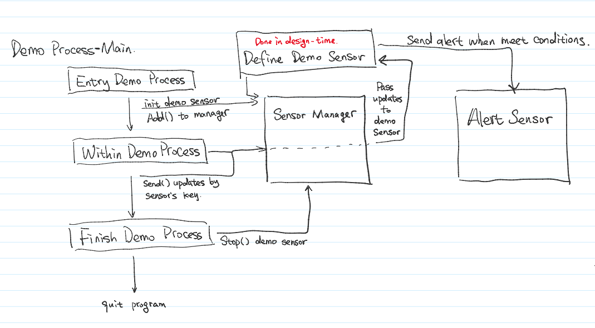

# Prototype of Sensor Architecture #

This product will create sensors to monitor information (setup by user) during the runtime, give alert when meet the condition given by user.

Powered by ***Akka*** to achieve all monitors and alerts are message driven. This repo is only prototype which means it creates a mocked process and integrate sensors to continue supervise the process.

### Environments ###

* Akka
* Java 8
* Maven
* Akka Quartz Scheduler
* 1.0.snapshot

### Setup ###

* Currently, project not been packaged, please import whole project to IDEA (or other IDE) and run project from ProgramEntry.main()

### Structure ###

* First I create a Jira board to track the project update, you can find here - [job board](https://qixiangzhou.atlassian.net/secure/RapidBoard.jspa?rapidView=3&projectKey=RSA&selectedIssue=RSA-3)
* All encapsulated class is under ```base package```
* Demo sensor is under ```process.sensors```
* All sensor will accept command which implement ```SensorCommand interface```
* Sensors are powered by Akka Actor which will also have a feature as message queue to avoid concurrent problem 

### Who do I talk to? ###

* Owner: [Qixiang Zhou](https://github.com/JIMsZHOU)